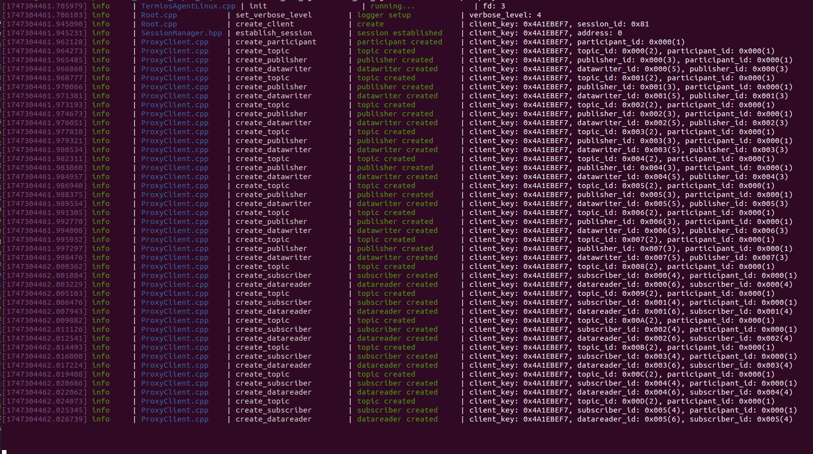
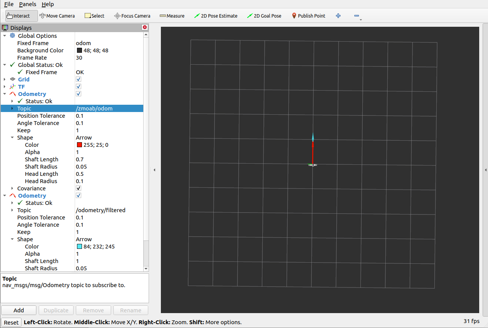

# ZMOAB Micro-ROS Utility

This package is a helper package to work with AT_ZMOAB_ROS01 board which running Micro-ROS [at_zmoab_ros](https://github.com/attraclab/at_zmoab_ros01.git).

## Node

**vel_odom_converter** : This node is used to compute odometry `/zmoab/odom` from wheels speed feedback `/zmoab/rpm_fb` and to convert command velocities `/cmd_vel` to wheels speed command `/zmoab/rpm_cmd`.

**laserscan_relay** : This node is used to subscribe on `/lidar_scan`, and re-publish it with proper frame_id as laser_frame and with topic name as `/scan`.

**led_status_handler** : This node is to interface with LED status depends on the robot scenarios. So far the LED status is as following,

- solid green : In RC manual mode.
- solid blue : In ROS control mode (AUTO).
- moving blue : In autonomous driving.
- blinking blue : During in autonomous driving, but in waiting for push button.
- blinking red : some error happened such as IMU data not coming.

**simple_navigation** : This node is a simple navigation program. The algorithms are stupid simple and doesn't use any of costmap or shortest path. Robot will using PID to turn to target point, then using another PID to control steering to move in straight line. There is no function to avoid or stop if there is object closely. The target point is selected by user responsibility to make sure there is no object blocking the way.

## Start node from at_zmoab_ros package

We need to install `micro-ros-agent` node, please check on how to install from [micro-ros-setup](https://github.com/micro-ROS/micro_ros_setup) package.

After built, we could start the node as following.

```sh
## Terminal 1
## source ros env and workspace
ros2 run micro_ros_agent micro_ros_agent  serial --dev /dev/ttyACM0

```

**Note** You many need to make sure what is your `/dev/tty***` for AT_ZMOAB_ROS01 board, and change that on the command above.




## Getting better odometry

We have `/zmoab/odom` which is wheel's odometry, and `/zmoab/imu_with_time` is IMU data. We can use this two topics with **robot_localization** node to fuse data together for better odometry. Please check on [launch/odom_ekf.launch.py](./launch/odom_ekf.launch.py) and [config/ekf.yaml](./config/ekf.yaml) for more detail.

```sh
## Terminal 1
## source ros2 env and workspace
## need to change wheel_sep value of left-right wheel distance
ros2 run zmoab_uros_utils vel_odom_converter.py --ros-args -p wheel_sep:=0.36

## Terminal 2
## source ros2 env and workspace
## Run odom ekf
ros2 launch zmoab_uros_utils odom_ekf.launch.py

## Terminal 3
## source ros2 and env and workspace
## go to zmoab_uros_utils/rviz folder
rviz2 -d odometry.rviz

```

Try moving the robot by radio transmitter in manual mode, and compare the `/zmoab/odom` and `/odometry/filtered`.



## Get LaserScan

LaserScan is an external sensor which not related to this package. But for example we are going to use Livox MID360 with [livox_ros_driver2](https://github.com/Livox-SDK/livox_ros_driver2.git) package. Before building this package, I would like to point out something, this package will be publishing PointCloud2 topic and we can convert that to LaserScan for 2D. But this PointCloud2 topic is using QoS of `reliable`, and cause some issue when using with other package. 

So I made a modification on [lddc.cpp](./livox_note/lddc.cpp) and [lddc.h](./livox_note/lddc.h) to publish with QoS of `best_effort`. Then please copy this to `src/` folder of that package, then build the package.

On the config file [MID360_config.json](https://github.com/Livox-SDK/livox_ros_driver2/blob/master/config/MID360_config.json), we need to change the IP address of our host computer and MID360's IP.

On the launch file, [msg_MID360_launch.py](https://github.com/Livox-SDK/livox_ros_driver2/blob/master/launch_ROS2/msg_MID360_launch.py), we need to set [xfer_format](https://github.com/Livox-SDK/livox_ros_driver2/blob/6b9356cadf77084619ba406e6a0eb41163b08039/launch_ROS2/msg_MID360_launch.py#L8) to 0 in order to publish standard PointCloud2 message.

Then to convert PointCloud2 topic to LaserScan topic, we are going to use [pointcloud_to_laserscan](https://github.com/ros-perception/pointcloud_to_laserscan.git) package.

```sh
## Terminal 1
## source ros2 env and workspace
## start livox node
ros2 launch livox_ros_driver2 msg_MID360_launch.py

## Terminal 2
## source ros2 env and workspace
## start pointcloud to laserscan node
ros2 launch zmoab_uros_utils pc2l_livox.launch.py

```

In this package there is [laserscan_relay.py](./zmoab_uros_utils/laserscan_relay.py) node, which subscribe on `/lidar_scan` topic the change the `frame_id` name to `laser_frame` and re-publishing that to `/scan`.

```sh
## Terminal 3
## source ros2 env and workspace
## start laserscan_relay node
ros2 launch zmoab_uros_utils  laser_pub.launch.py

```

## Working with Navigation2

In order to use with Nav2, we need to have at least TF of `odom -> base_link -> laser_frame`, with odometry and laserscan topics. From previous launch files we could achieve that. So make sure odometry and lasercan nodes are running.

Now you can use `slam_toolbox`  or `nav2_bringup` from Nav2 package.

We can make a map by following,

```sh
## Terminal 1
## source ros2 env and workspace
## change directory to zmoab_uros_utils/rviz
rviz2 -d slam_mapping.rviz

## Terminal 2
## source ros2 env and workspace
ros2 launch slam_toolbox online_async_launch.py slam_params_file:=~/dev_ws/src/zmoab_uros_utils/config/mapper_params_online_async.yaml

## Make sure the directory of workspace is correct.

```

Try moving around to create the map of your place. Once the map is fully created, save the map with following.


```sh
## Terminal 3
## source ros2 env and workspace
ros2 run nav2_map_server map_saver_cli -f your-map-name

```

We are going to put laserscan node inside localization launch file, please check on [launch/localization_launch_humble.py](./launch/localization_launch_humble.py) then start localization node with following.

```sh
## Terminal 1
## source ros2 env and workspace
## change directory to zmoab_uros_utils/rviz
rviz2 -d amcl_with_path.rviz

## Terminal 2
## source ros2 env and workspace
ros2 launch  zmoab_uros_utils localization_launch_humble.py params_file:=~/dev_ws/src/zmoab_uros_utils/config/nav2_amcl.yaml map:=~/map/your-map-name.yaml

## you will need to change the workspace directory and your-map-name to correct one.
```

For full navigation and localization, please run as following.

```sh
## Terminal 1
## source ros2 env and workspace
## change directory to zmoab_uros_utils/rviz
rviz2 -d nav2_bringup_humble.rviz

## Terminal 2
## source ros2 env and workspace
ros2 launch zmoab_uros_utils  bringup_humble.py params_file:=~/dev_ws/src/zmoab_uros_utils/config/nav2_params_humble_atbot.yaml  use_sim_time:=False autostart:=True map:=~/map/your-map-name.yaml

## you will need to change the workspace directory and your-map-name to correct one.

```


